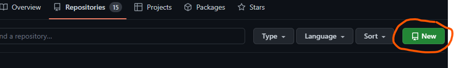
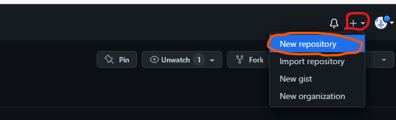
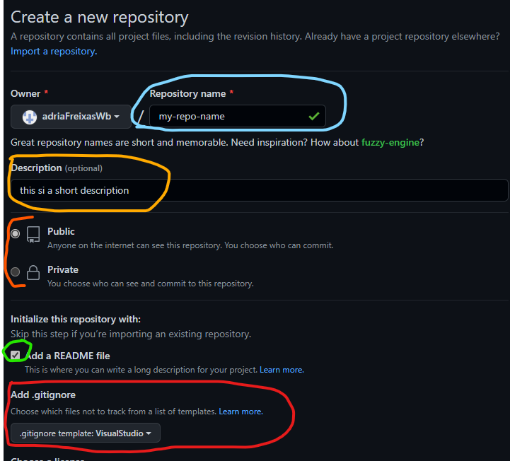
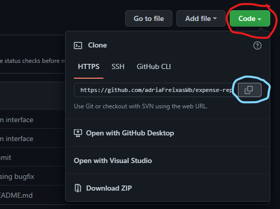
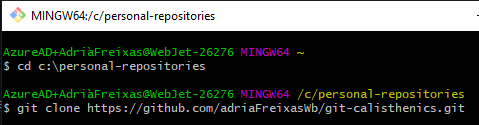

# Git Calisthenics
Learn git bash using 10 minutes a day

## Session 1: Create a repository change files commit and push to main

Using your git repository of choice, [Github](https://github.com/) for example.
1. Create new repository through web interface
2. Clone
3. Modify readme 
4. Commit with message
5. Push

### Create repository

There are 2 ways of creating a new repository on your git website:
> Got to your profile page, that would be https://github.com/[your-user-name-here]

1. Click on repositories tab then on new
2. At the top right of your page there is a **+** dropdown and there you can select new repository

*On repositories tab click new button*




*Top right dropdown*



When done with either of the former:

1. Name your repository
2. Fill up your description
3. Choose if you want your repo public or private
4. Click on *Create repository*


*Create and name repository through web site*




### Clone your repository

There are 2 ways to get your repository url:
1. Copy your repository base address
2. On the website, click Code makes sure you are on the Https tab and copy to clipboard

*Click Code makes sure you are on the Https tab and copy to clipboard*


Now open up a command prompt on your computer, navigate to your favourite folder for storing source code and clone your repository. Your git clone command is typically
as follows

```
git clone [url-to-your-repo]
```

*Navigate to your source code folder and clone your repository*



### Commiting changes and pushing them

1. Change add text to README.md file
2. Run git status to see your modified files
3. Add your modified files as staged
4. Create a commit with a message
5. Push your commit to main

*Status, add staged files, create a commit with a message and push*


## Session 2: Create a new branch add changes, commit and push

Your first action would be to list the branches on your system.
```
git branch
``` 
This will list your branches

