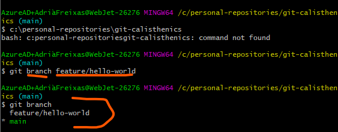
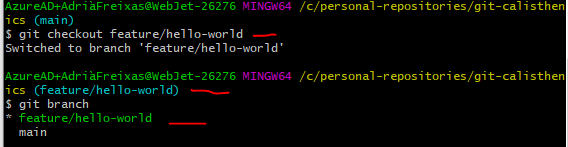
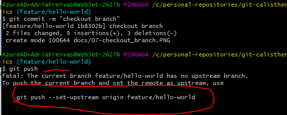
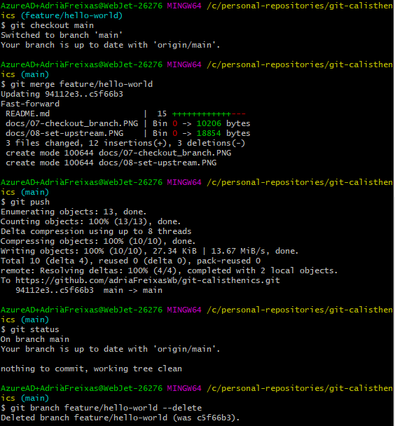
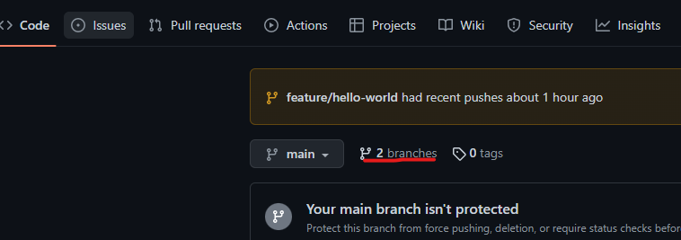

# Create a new branch add changes, commit and push

Your first action would be to list the branches on your system.
```
git branch
``` 
This will list your branches

## Branching

Lets create a new branch with the following command
```
git branch feature/hello-world
```

Once the former command gets executed a new branch will be created. If we execute the introductions command (git branch) now we will have main and our new branch created.



As you can see the asterisk is still on main, so even though we created a new branch we are not using it yet. 

## Checkout a branch

In order to switch from main to your newly created branch, use the following command.

```
git checkout feature/hello-world
```
If you run your branch command again you can see that the asterisk is at feature/hello-world


As your an see when you try to push your changes, the command prompt tells you that you have no remote branch that tracks your local


```
git push --set-upstream origin feature/hello-world
```

Once your done pushing:
1. checkout main 
2. merge feature/hello-world 
3. push 

## Delete an old branch

Now, you are done merging your changes in to main and feature/hello-world is a stale branch.

*To delete your branch user*
```
git branch [your-branch-name] --delete
```



Bear in mind the the former command only deletes your local branch. To delete your remote branchs: 

Go to your git website interface and select branches tab

Search for the branch you want to delete and click on the trash bin icon
