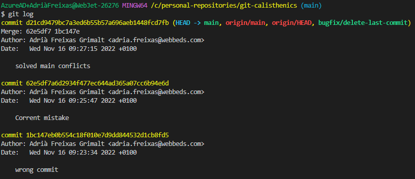

# Git history

Up until now we never paid much attention to what happened behind the scenes with our commits. <br/>
One of the most attractive features of **Git** is the ease to review what happened in the past, we can go commit by commit and se what the changes were.

## Commits: what are they?

Commits are the core building block units of a Git project timeline. <br/>
Commits can be thought of as snapshots or milestones along the timeline of a Git project <br/>

> Git’s version control model is based on snapshots. Git, records the entire contents of each file in every commit.

Therefore, you don't have to worry about losing increments, every commit has as snapshot of the full file and can be checked out as if it were a branch to see what was going on at that point.

Let's review our commits to see what was going on in the past with our code base.
You have to ways two do that: <br/><br/>
[Review through remote website](#Review-your-commits-through-your-git-web-interface) <br/>
[Review using git log](#Review-your-commits-Git-logs)

## Review your commits through your git web interface

To review your commit history, do as follows:
1. Visit your git web interface
2. Make sure you are at the code tab
3. Look for the header of the table that list all your files
4. Commits link with a number at the right side of the above header
5. Click it to access your commit history

*Commits link* <br/>
  <br/>

*Your commit history* <br/>

  <br/>

If you click at the name or the hash number of any of the above you will see your commit detail  <br/>

  <br/>

## Review your commits Git logs

You can do the same this as you did at the [former section](#Review-your-commits-through-your-git-web-interface) with the following command:
```
git log
```
> Press **q** to exit git logs, or press enter to continues seeing next log page.

You will get a page like the following.


## Commits: what are they?

Commits are the core building block units of a Git project timeline. Commits can be thought of as snapshots or milestones along the timeline of a Git project
Git’s version control model is based on snapshots. Git, records the entire contents of each file in every commit.

Therefore you don't have to worry losing increments, every commit has as snapshot of the full file and can be checked out as if it were a branch to see what was going on at that point.

## Checking out commits

Another intersting thing about commits is that they have a hash number that identifies them.<br/>
Remember [Review your commits with git logs section](#review-your-commits-git-logs), as a title of every commit has a hashed number beside like *commit d21cd9479bc7a3ed6b55b57a696aeb1448fcd7fb*. <br/>

## What is a git's HEAD?

Notice also from the dump of git log command:
```
HEAD -> main, origin/main, origin/HEAD, bugfix/delete-last-commit)
```
Imagin that we are playing a disc record, every track has a time code (just like every commit has a hash number), in this analogy HEAD would be the record player nidle.
So the above caption meand that HEAD (our nidle) is at main branch (our track), at origin (our remote prepository) HEAD is also aligned with our main branch. The lasst part just means that last action was merging bugfix/delete-last-commit to master.

And if you se where this is going, as you can move niddle to any point of your record, you can also move the HEAD. But more on that on our [Next Session](Session9.md)

### Moving git's HEAD 

HEAD is where de repository is pointing at. **(HEAD -> main** means that our local head is up to date with all commit at main branch.

We could move the HEAD to any commit using the following command
```
git commit [commits-has-humber]
```

For example, if I take the hush of the previous commit (62e5df7a6d2934f477ec644ad365a07cc6b94e6d) and go
```
git checkout 62e5df7a6d2934f477ec644ad365a07cc6b94e6d
```
Now I get:
```
$ git checkout 62e5df7a6d2934f477ec644ad365a07cc6b94e6d
Note: switching to '62e5df7a6d2934f477ec644ad365a07cc6b94e6d'.

You are in 'detached HEAD' state. You can look around, make experimental 
changes and commit them, and you can discard any commits you make in this
state without impacting any branches by switching back to a branch.      

If you want to create a new branch to retain commits you create, you may 
do so (now or later) by using -c with the switch command. Example:       

  git switch -c <new-branch-name>

Or undo this operation with:

  git switch -

Turn off this advice by setting config variable advice.detachedHead to false

HEAD is now at 62e5df7 Corrent mistake
M       docs/Session8.md
```

Meaning that I have my HEAD on a commit that is not consistent with any branch (enche detached). And that we are back at our previous commit that has changes only on docs/Session8.md.

To leave this state as the text says execute
```
git switch -
```

And you would be back to main.

