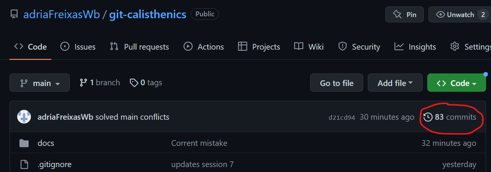
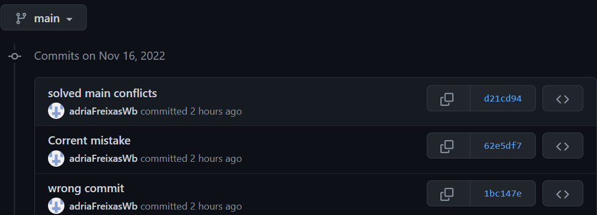
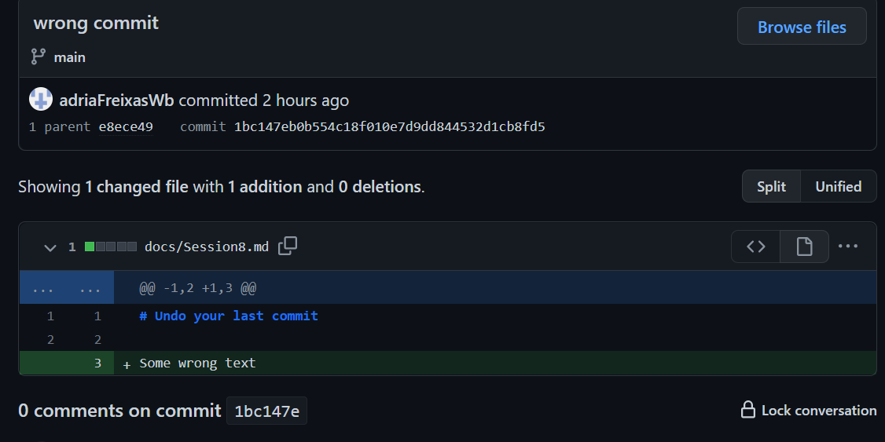

# Git history

Up until now we never paid much attention to what happened behind the scenes with our commits
So let's review our commits to see what happened in the past.

## Review your commits through your git web interface

To review your commit history, do:
1. Visit your git web interface
2. Make sure you are at the code tab
3. Look for the header of the table that list all your files
4. Commits link with a number at the right side of the above header
5. Click it to access your commit history

*Commits link*


*Your commit history*


If you click at the name or the hash number of any of the above you will see your commit detail


## Review your commits Git logs

You can do the same that you did on the former section with the following command:
```
git log
```
Press **q** to exit git logs, or press enter to continues seeing next log page.

You will get a page like the following.


As you can see every commit has a hashed number beside like commit d21cd9479bc7a3ed6b55b57a696aeb1448fcd7fb. Also notice the HEAD -> main, origin/main, origin/HEAD, bugfix/delete-last-commit)

## HEAD on git 

HEAD is where de repository is pointing at. **(HEAD -> main** means that our local head is up to date with all commit at main branch.

We could move the HEAD to any commit using the following command
```
git commit [commits-has-humber]
```

For example, if I take the hush of the previous commit (62e5df7a6d2934f477ec644ad365a07cc6b94e6d) and go
```
git checkout 62e5df7a6d2934f477ec644ad365a07cc6b94e6d
```
Now I get:
```
$ git checkout 62e5df7a6d2934f477ec644ad365a07cc6b94e6d
Note: switching to '62e5df7a6d2934f477ec644ad365a07cc6b94e6d'.

You are in 'detached HEAD' state. You can look around, make experimental 
changes and commit them, and you can discard any commits you make in this
state without impacting any branches by switching back to a branch.      

If you want to create a new branch to retain commits you create, you may 
do so (now or later) by using -c with the switch command. Example:       

  git switch -c <new-branch-name>

Or undo this operation with:

  git switch -

Turn off this advice by setting config variable advice.detachedHead to false

HEAD is now at 62e5df7 Corrent mistake
M       docs/Session8.md
```

Meaning that I have my HEAD on a commit that is not consistent with any branch (enche detached). And that we are back at our previous commit that has changes only on docs/Session8.md.

To leave this state as the text says execute
```
git switch -
```

And you would be back to main.

## Commits: what are they?
